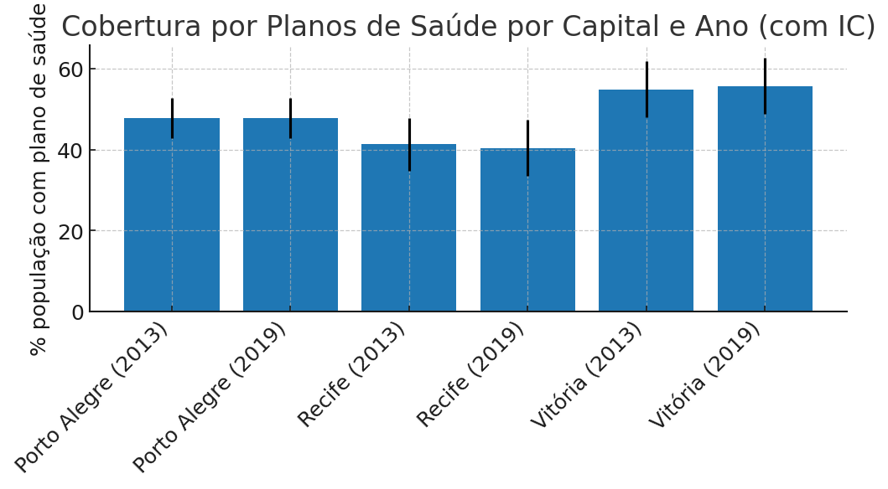
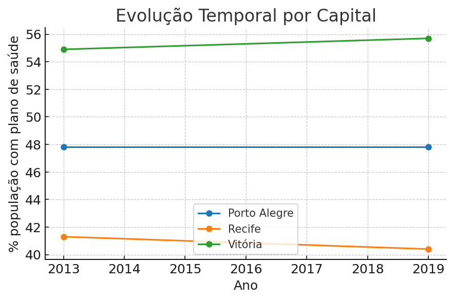
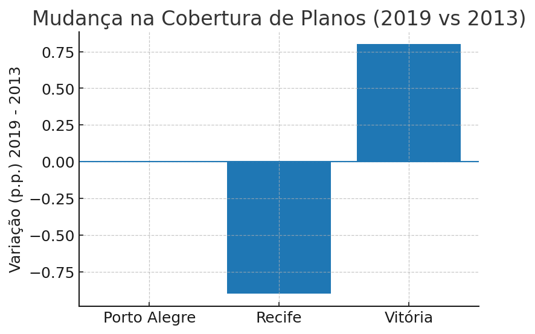

# Analise-de-atratividade-para-investimento-em-cl-nica-de-ressonancia-magnetica
Análise de atratividade para investimento em clínica de ressonância magnética Inclui: simulação de dados, cálculos de indicadores e ranking com 3 cenários de pesos. Aluna: Tathiana Martins - tsm2@cesar.school

[Relatório de cobertura de planos de saúde nas três capitais](relatorio_cobertura_planos_saude.html)

---

# Análise de Atratividade – Cobertura de Planos de Saúde  

*Relatório resumido a partir do notebook original – focado em capitais com dados disponíveis (2013 e 2019).*  

---

## 1) Base analisada  
Percentual de pessoas com plano de saúde por capital e ano, com intervalos de confiança (IC).  

| Capital       | % com plano | IC Inferior | IC Superior | Ano  |
|---------------|-------------|-------------|-------------|------|
| Porto Alegre  | 47.8        | 42.8        | 52.8        | 2013 |
| Vitória       | 54.9        | 48.0        | 61.9        | 2013 |
| Recife        | 41.3        | 34.8        | 47.8        | 2013 |
| Recife        | 40.4        | 33.4        | 47.4        | 2019 |
| Vitória       | 55.7        | 48.7        | 62.6        | 2019 |
| Porto Alegre  | 47.8        | 42.8        | 52.8        | 2019 |

---  

## 2) Gráficos  

### 2.1 Cobertura por Capital e Ano (com IC)  
  

### 2.2 Evolução Temporal por Capital

### 2.3 Variação 2019 vs 2013

---

## 3) Insights Exploratórios  

- **Vitória** mantém a maior cobertura entre as capitais avaliadas (>55%), indicando um mercado com alta penetração de planos.  
- **Porto Alegre** apresenta cobertura estável (~48%).  
- **Recife** mostra cobertura mais baixa (~40–41%) e leve queda em 2019, com incerteza maior (IC mais amplo no histórico).  
- Em geral, ICs são moderados, sugerindo precisão estatística aceitável para comparações entre capitais.  

---

## 4) Conclusão  

Para um investimento dependente de convênios (como clínicas de imagem), a atratividade tende a ser maior em capitais com maior percentual populacional coberto por planos, estabilidade ao longo do tempo e menor incerteza amostral.  

- **Mais atrativas**: Vitória e Porto Alegre (maior/estável cobertura).  
- **Risco maior**: Recife (cobertura menor e tendência de queda).  

